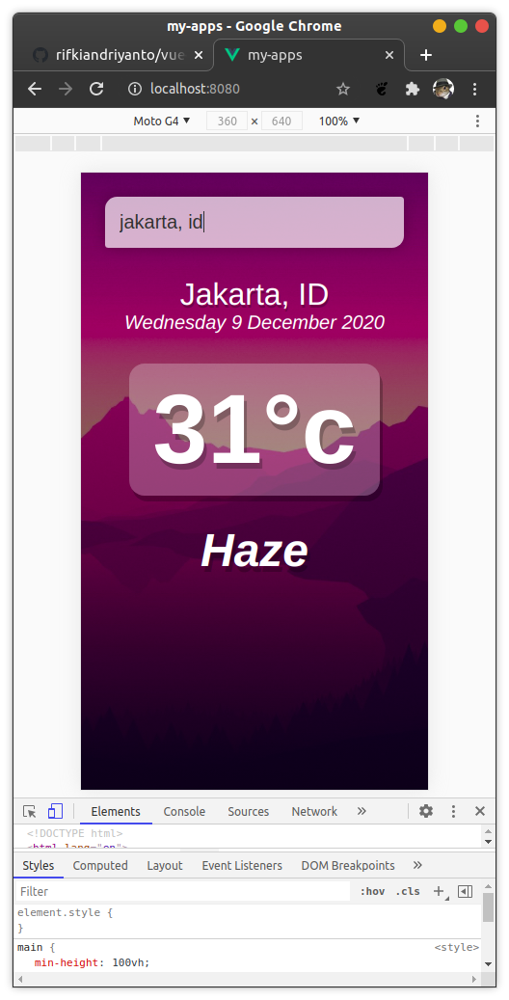

# vue-weatherapp

## vue-weatherapp Demo


## Project setup

```
yarn install
```

### Compiles and hot-reloads for development

```
yarn serve
```

### Compiles and minifies for production

```
yarn build
```


### Lints and fixes files

```
yarn lint
```

### Customize configuration

See [Configuration Reference](https://cli.vuejs.org/config/).
&nbsp;


## Run in browser
Run in mobile mode coz I'm designed like that
&nbsp;
&nbsp;

### Register API weathermap
See [Signup to create API weather ](https://api.openweathermap.org)
